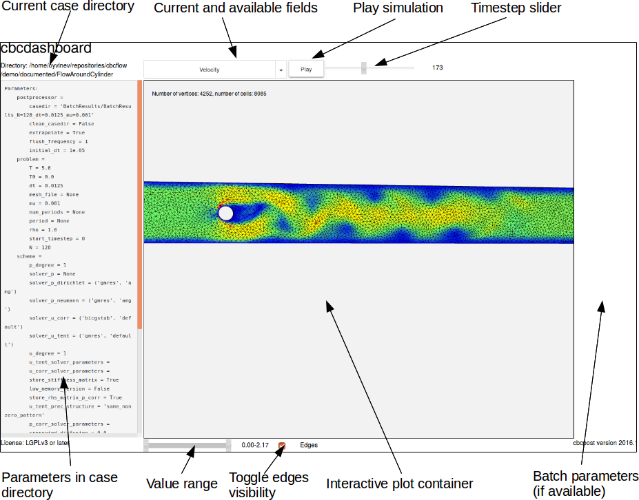
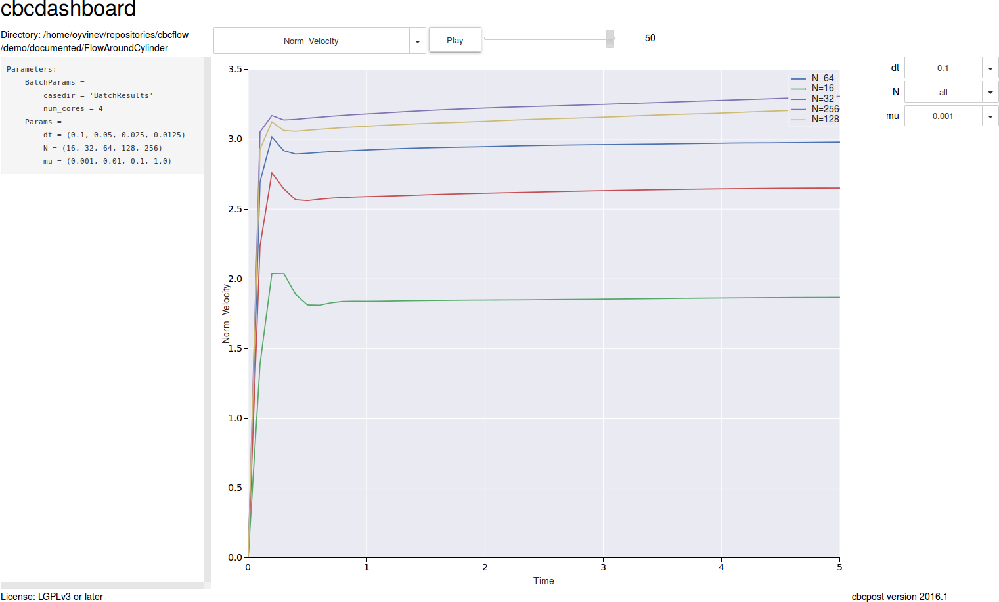
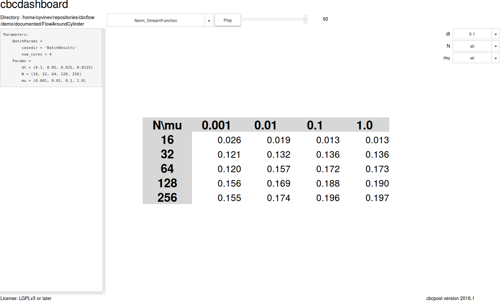

Dashboard view (cbcdashboard)
--------------------------------
To easily view the results of a simulation postprocessed with cbcpost, you can use *cbcdashboard*. This is a command line scripts that launch a jupyter notebook
server, and opens a notebook containing a GUI to investigate the provided case directory. The case directory can either be a directory for a single simulation,
or containing results from a *cbcbatch*-run.

To view results launch the dashboad like this:

.. code-block:: bash

    cbcdashboard casedir

execute the first cell of the notebook, the GUI will launch and show you the available simulation results, here with denoted widget areas:

The interactive plot is an HTML-container that change based on the selected value, and can show both dolfin Functions (through X3DOM), time-dependent scalars and vectors (through
matplotlib and mpld3.figure_to_html), constant scalars and, in the case of batch directories, tables of constant scalars (through pandas.DataFrame.to_html).

Showing batch results can be done by pointing cbcdashboard to a directory created with *cbcbatch* and containing the results of that batch simulations. This will launch a
slightly different GUI, where you have the ability to select single batch parameters or set one or two batch parameter to *all*. When a batch parameter is set to *all*, it
will show the fields available for comparison between the simulations, allowing for detailed inspection of parameter sensitivity:

By specifying all parametersm you can investigate the solutions directly, similar to what you can if specifying a single case directory.

Currently, you can only change the browser to open the notebook in from the command line, by passing *browser=my-favourite-browser* to cbcdashboard.

