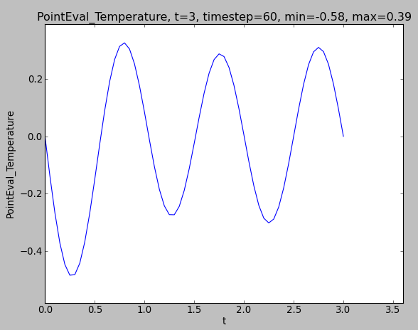

The postprocessor
--------------------------------
The :class:`.PostProcessor`-class is responsible for all the logic behind the scenes. This includes logic related to:

- Dependency handling
- Planning and caching of computation
- Saving
- Plotting

The planning, saving and plotting is delegated to dedicated classes (:class:`.Planner`, :class:`.Saver` and :class:`.Plotter`), but is called from within a :class:`.PostProcessor`-instance.

The *update_all*-function
`````````````````````````````
The main interface to the user is through the :meth:`.PostProcessor.update_all`-method. This takes three arguments: a *dict* representing the solution, the solution time and the solution timestep.

The time and timestep is used for saving logic, and stored in a *play log* and metadata of the saved data. This is necessary for the replay and restart functionality, as well as order both the saved and plotted fields.

The solution argument should be of the format:

.. code-block:: python

    solution = dict(
        "Velocity": lambda: u
        "Pressure": lambda: p
    )

Note that we pass a lambda function as values in the dict. This is done to give the user the flexibility for special solvers, and can be replaced with any callable to do for example a conversion. This can be useful when there are discrepancies between the solver solution, and the desired *physical* solution. This could be for example a simple scaling, or it could be that a mixed or segregated approach is used in the solver.

Because this function might be non-negligible in cost, it will be treated in the same manner as the :meth:`.Field.compute`-method, and not called unless required.


.. _dependency-handling:

Dependency handling
````````````````````````````````````
When a field is added to the postprocessor, a dependency tree is built. These dependencies represent the required fields (or time parameters) required to succesfully execute the *compute*-method.

The source code of the *compute*-function is inspected with the *inspect*-module, by looking for calls through the *get*-argument, and build a dependency tree from that.

Assume that the following code is executed:

.. code-block:: python

    pp = PostProcessor()
    pp.add_field(SolutionField("F"))
    pp.add_field(TimeDerivative("F"))


In that case, when the :class:`.TimeDerivative`-field is added to the postprocessor, the following code is inspected:

.. code-block:: python

    class TimeDerivative(MetaField):
        def compute(self, get):
            u1 = get(self.valuename)
            u0 = get(self.valuename, -1)

            t1 = get("t")
            t0 = get("t", -1)

            # ... [snip] ...

By evaluating the *get*-calls here, we are able to build the following dependency tree:

.. figure:: ../_static/timederivative_tree.png
    :align: center
    :scale: 50 %
    :alt: Dependency tree built by pp.add_field(TimeDerivative("F"))db


If we extend the above example to add the time derivative of the viscous stress tensor (see :ref:`stress-tensor`) like the following:

.. code-block:: python
    :emphasize-lines: 3,4

    pp = PostProcessor()
    pp.add_fields([SolutionField("Velocity"), SolutionField("Pressure")])
    pp.add_field(Stress())
    pp.add_field(TimeDerivative("Stress"))

The first emphasized line will trigger building of the dependency tree for the stress:


while the second emphasized line will use this dependency tree, and trigger the building of the larger dependency tree


Planner
``````````````````
The :class:`.Planner`-class will set up a plan of the computations for the coming timesteps. This algorithm will inspect the dependencies of each field, and compute the necessary fields at the required time.

In addition, it determines how long each computation should be kept in cache.

.. note::
    This does not yet support variable timestepping.


Saver
``````````````````
The :class:`.Saver`-class handles all the saving operations in cbcpost. It will determine if and how to save based on Field-parameters. In addition, there are helper methods in :class:`.PostProcessor` for saving mesh and parameters.

For fields, several saveformats are available:

==============================   ==================     =================
**Replay/restart-compatible**    **Visualization**      **Plain text**
------------------------------   ------------------     -----------------
hdf5                              xdmf                  txt
xml                               pvd
xml.gz
shelve
==============================   ==================     =================

The default save formats are:

- *hdf5* and *xdmf* if data is dolfin.Function
- *txt* and *shelve* if data is float, int, list, tuple or dict

The saving is done in a structured manner below the postprocessors case director. Consider the following example:

.. code-block:: python

    pp = PostProcessor(dict(casedir="Results/"))
    pp.add_fields([
        SolutionField("Pressure", save=True),
        Norm("Pressure", save=True),
    ])
    pp.store_mesh(mesh, facet_domains=my_facet_domains,
                  cell_domains=my_cell_domains)
    pp.store_params(
        ParamDict(
            mu = 1.5,
            case = "A",
            bc = "p(0)=1",
        )
    )

Here, we ask the postprocessor to save the Pressure and the (L2-)norm of the pressure, we store the mesh with associated cell- and facet domains, and we save some (arbitrary) parameters. (Note the use of :class:`.ParamDict`).

This will result in the following structure of the *Results*-folder:


Plotter
``````````````````
Two types of data are supported for plotting:

- dolfin.Function-type objects
- Scalars (int, float, etc)

The :class:`.Plotter`-class plots using dolfin.plot or pyplot.plot depending on the input data. The plotting is updated each timestep the Field is directly triggered for recomputation, and rescaled if necessary. For dolfin plotting, arguments can be passed to the dolfin.plot-command through the parameter *plot_args*.


    dolfin.Function objects are plotted with dolfin.plot




    Simple scalars are plotted with pyplot


