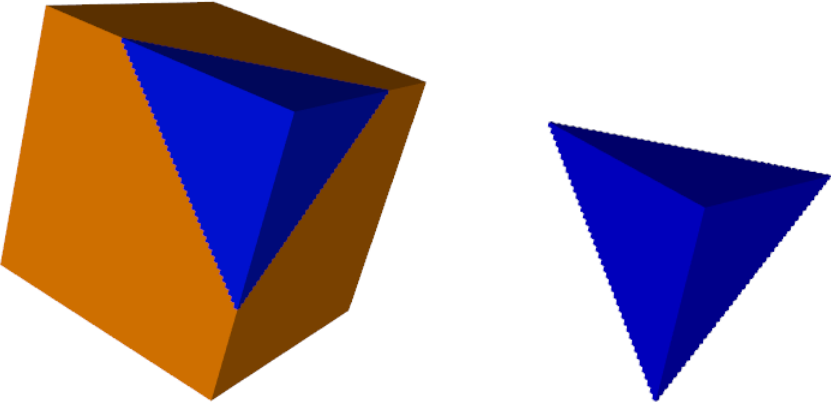
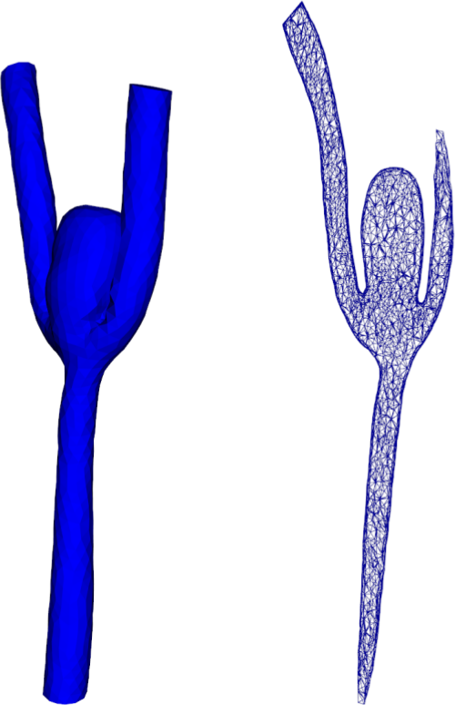

Utilities
----------------

A set of utilities are provided with cbcpost. Below are just a few of them. For a more complete set of utilities, refer to the :ref:`programmers-reference`.

The :class:`.ParamDict`-class
````````````````````````````````````
The :class:`.ParamDict`-class extends to the stadard python *dict*. It supports dot-notation (*mydict["key"] == mydict.key*), and nested parameters.

.. todo::
    Extend this documentation.


The :class:`.Parameterized`-class
````````````````````````````````````
The :class:`.Parameterized`-class is sued for classes that are associated with a set of parameters. All subclasses must implement the method :meth:`.Parameterized.default_params`, which return a ParamDict/dict with default values for the parameters.

When initialized, it takes a *params*-option where specific parameters are set, and overwriting the associated parameters returned from *default_params*. This is then stored in an attribute *params* attached to the object.

When initializing a Parameterized-object, no new keys are allowed. This means that all parameters of a Parameterized-instance must be defined with default values in *default_params*.

The class is subclasses several places within cbcpost:

- :class:`.Field`
- :class:`.PostProcessor`
- :class:`.Restart`
- :class:`.Replay`


Pooling of function spaces
````````````````````````````````````
When using many different functions across a large function, it may be useful to
reuse FunctionSpace definitions. This has two basic advantages:

- Reduced memory consumption
- Reduced computational cost

Space pools are grouped according to mesh, with *Mesh.id()* used as keys in
a *weakref.WeakValueDictionary*. Once a mesh is out of focus in the program,
the related SpacePool is removed.

Submesh creation
````````````````````````````````````
The :class:`SubMesh`-class in dolfin is not currently supported in dolfin. In cbcpost, the function :func:`.create_submesh` is the equivalent functionality, but with parallel support.

This allows for arbitrary submeshes in parallel based by providing a MeshFunction and marker.




    Submesh created with *create_submesh* in cbcpost.


Mesh slicing
````````````````````````````````````
Three-dimensional meshes can be sliced in cbcpost with the Slice-class. The :class:`.Slice`-class takes basemesh, togetther with a point and normal defining the slicing plane, to create a slicemesh.

The :class:`.Slice`-class is a subclass of dolfin.Mesh.



    A complex 3D-mesh, with an associated slicemesh.


.. warning::

    Slice-instances are intended for visualization only, and may produce erronous
    results if used for computations.
    


